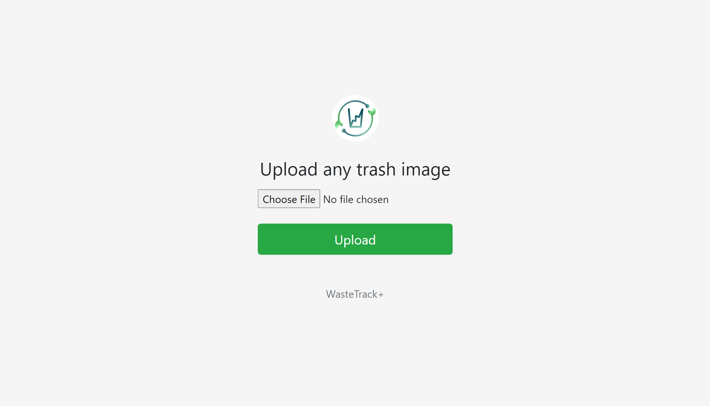
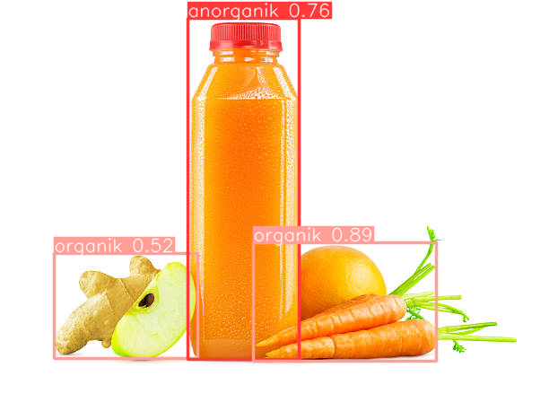

# WasteTrack YOLO Flask

This is a simple waste classification project that utilizes the YOLO (You Only Look Once) object detection algorithm to classify waste items as organic or inorganic. The project is implemented in Python using the Flask web framework.

## 📷 Screenshot



## ✨ Prerequisites

- Python 3.x
- Flask
- Ultralytics
- Pillow
- PyTorch

## 🤖 Installation

1. Clone the repository:
   ```shell
   git clone https://github.com/bimarakajati/WasteTrack-YOLO-API.git
   ```

2. Install the required dependencies:
    ```shell
    pip install -r requirements.txt
    ```

## 💁‍ Usage

1. Run the Flask app:
   ```shell
   python main.py
   ```
2. Open your web browser and navigate to http://localhost:5000 to access the waste classification application.
3. On the web interface, click the "Choose File" button to upload an image of a waste item.
4. Click the "Upload" button to initiate waste classification.
5. Wait for the classification results to be displayed. The application will identify the waste item in the image and classify it as organic or inorganic.

## ✨ Author

|         Nama         |      NIM       |  Job Desk  |
| -------------------- | -------------- |------------|
| Rizky Okka Syahputra | A11.2020.13067 | Anorganik  |
| Fajarudin Zakariya   | A11.2020.12483 | Organik    |
| Bima Rakajati        | A11.2020.13088 | Flask      |
| Enrico Zada          | A11.2020.12972 | Docker     |

## 📙 Reference

Thanks to their great works：
- https://github.com/ultralytics/yolov5
- https://github.com/robmarkcole/yolov5-flask